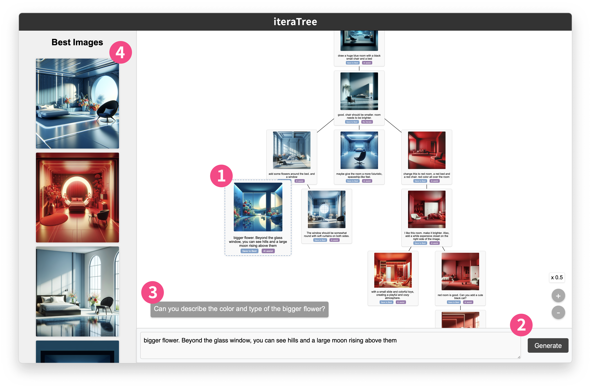

# iteraTREE 🌱

iteraTREE is an interactive system designed to enhance the **trial-and-error process** in text-to-image generation. By leveraging a **tree-based structure**, it helps users visualize their iteration history, refine prompts more effectively, and confidently navigate AI-generated outputs.




**Figure. User interface of iteraTree.**  
(1) Users can freely navigate the tree-based structure, with the selected node appearing larger to indicate it as the starting point for the next child prompt.  
(2) The "Generate" button allows users to create images by harmonizing the selected node's prompt with the user’s new prompt.  
(3) The "AI Assist" button in a node provides suggestion popup specific to that prompt, addressing missing attributes.  
(4) The "Save to Best" button adds images to the "Best Images" column for efficient comparison.

---

## 🚀 Features
### 🔹 Tree-Based Exploration  
- Provides a **visual history of generated images** in a hierarchical structure.  
- Users can revisit previous iterations and select any point to **restart the refinement process**.

### 🔹 Best Image Selection  
- Includes a dedicated **"Best Images" column** to help users compare and identify optimal results.  
- Enables quick access to **notable outputs for better decision-making**.

### 🔹 AI-Assisted Prompt Refinement  
- **Analyzes prompts** to distinguish objects and attributes, providing **structured hints** for refinement.  
- Helps users **enhance specificity** without requiring expertise in prompt engineering.  

---

## 🛠 Implementation
- **Frontend**: HTML, CSS, JavaScript  
- **Backend**: Node.js  
- **AI Integration**: OpenAI's GPT-4 (for text-based refinements) & DALL·E 3 (for image generation)  

The system employs a **tree-based architecture**, where each node represents a generated image along with its associated prompt. When generating a new image, the system references the parent node’s stored prompts, refining them using **system prompts** before passing them to the AI model.  

This structure ensures a **clear and organized progression** of iterations, allowing users to **efficiently refine their ideas** through guided AI assistance.  

---

## 🎨 User Interaction  
- The **right section** of the interface presents the tree-based visualization for exploring generated images.  
- The **left section** hosts the "Best Images" column for side-by-side comparison.  
- Each generated image includes:  
  - **"Save to Best"** → Adds the image to the comparison column.  
  - **"AI-assist"** → Copies the prompt, provides refinement hints, and regenerates an updated image.  

By integrating **pattern recognition and AI-driven guidance**, iteraTREE streamlines the creative workflow and **reduces the cognitive load** involved in prompt refinement.

---

## 📌 Getting Started
### 1. Clone the Repository  
```
git clone git@github.com:DainPixel/iteraTREE.git
cd iteraTREE
```
### ️2. Install Dependencies
```
npm install
```
### 3. Run the Local Server
```
node server.js
```
Then, open http://localhost:3000 in your browser.

## Contributing & License

We welcome contributions! Feel free to submit issues, suggestions, or pull requests to improve iteraTREE. This project is licensed under the MIT License. When using or referencing this project, please credit DainPixel and include a link to GitHub.
